# ✋ EMGBand - Hand Bionic

	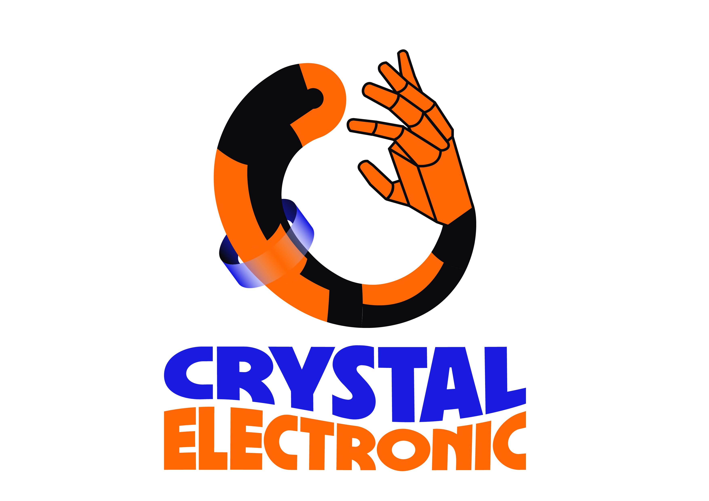 
	<strong>Muscle intent in → bionic motion out.</strong>   

	
	&nbsp;
	

EMGBand / Hand Bionic is a full-stack, open hardware kit that turns forearm muscle signals into predictable, servo-safe hand motion. It is built to be hackable, reproducible, and fast to demo: one bill of materials, one firmware pair (ring + hand), one Flutter app to calibrate and ship.

Designed for makers, researchers, and product teams, EMGBand focuses on reliability, safety, and repeatability. The repo bundles manufacturing-ready assets (Gerbers, BOMs), production photos, a tested ESP32 firmware pair, and a Flutter app that makes calibration and demos straightforward.

## Table of Contents
- 🔍 [What this repo delivers](#what-this-repo-delivers)
- 🖼️ [Quick gallery](#quick-gallery)
- 🧭 [Platform at a glance](#platform-at-a-glance)
- ⚙️ [Architecture snapshot](#architecture-snapshot)
- 📚 [Deep dives](#deep-dives)
- 🚀 [Fast start](#fast-start)
- ✨ [Tech highlights](#tech-highlights)
- 📜 [Licence](#licence)
- 🙏 [Thanks](#thanks)

| | | |
| --- | --- | --- |
|  |  |  |

Wearable EMG ring + controller blocks from the latest build.

## What this repo delivers
- **Hardware you can fabricate**: KiCad projects for the MyoBand EMG front-end, hand controller, and modular sensor blocks. Gerbers, pick-and-place, and reference photos are ready for a quick manufacturing turn.
- **Firmware that guards the hardware**: ESP32 (ring + hand) stack with EMG filtering, intent classification, BLE services, OTA hooks, and stall-safe servo control so experiments stay repeatable and safe.
- **App that closes the loop**: Flutter client to scan, pair, stream EMG, calibrate thresholds (Line/Radar), push configs, and swap control modes without reflashing.
- **Media to build confidence**: Photos and demo videos to set assembly expectations before you order or solder.

## Quick gallery

See how the wearable comes together before diving into schematics or code.

| | | |
| --- | --- | --- |
|  <small>📸 Assembled unit 1</small> | 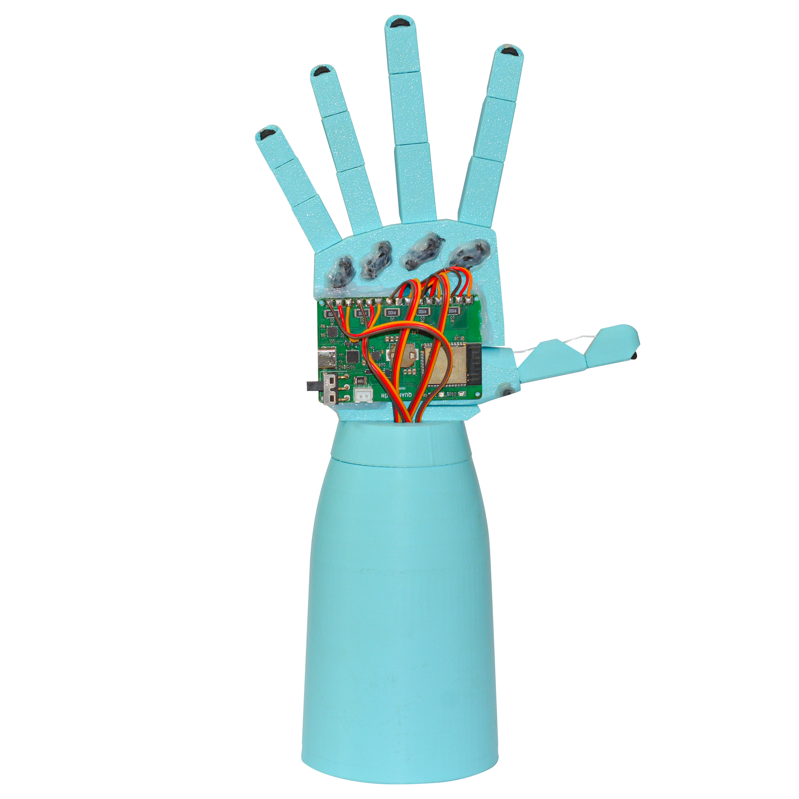 <small>📸 Assembled unit 2</small> | 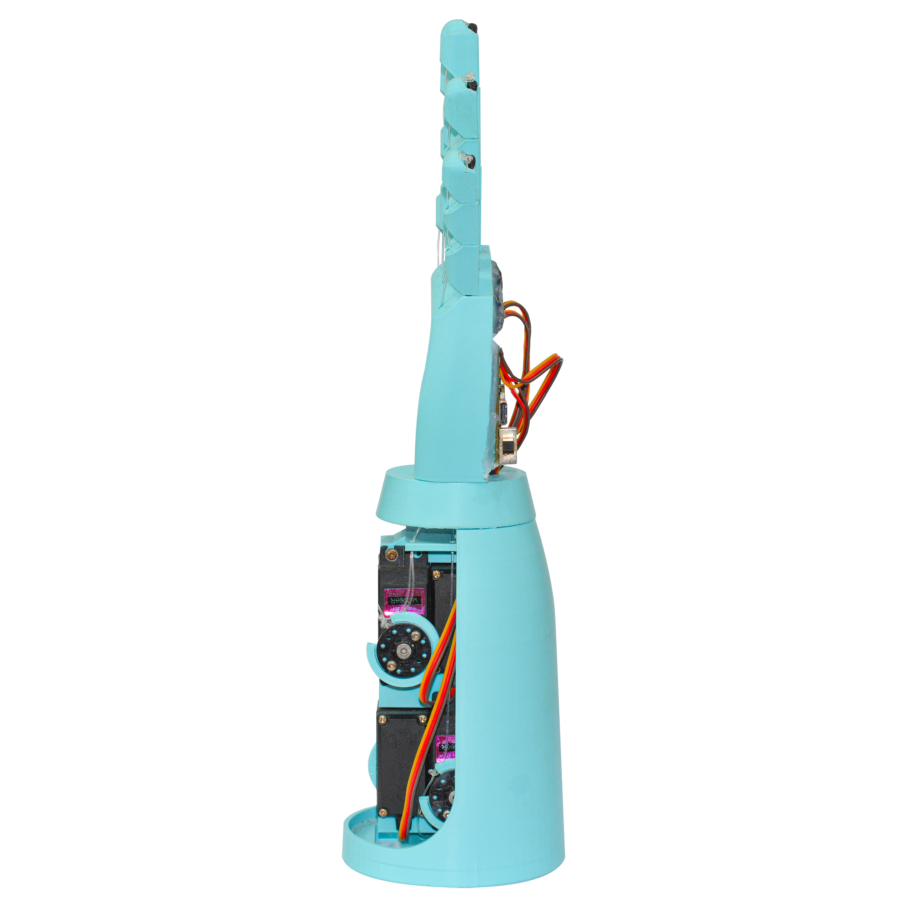 <small>📸 Assembled unit 3</small> |
| 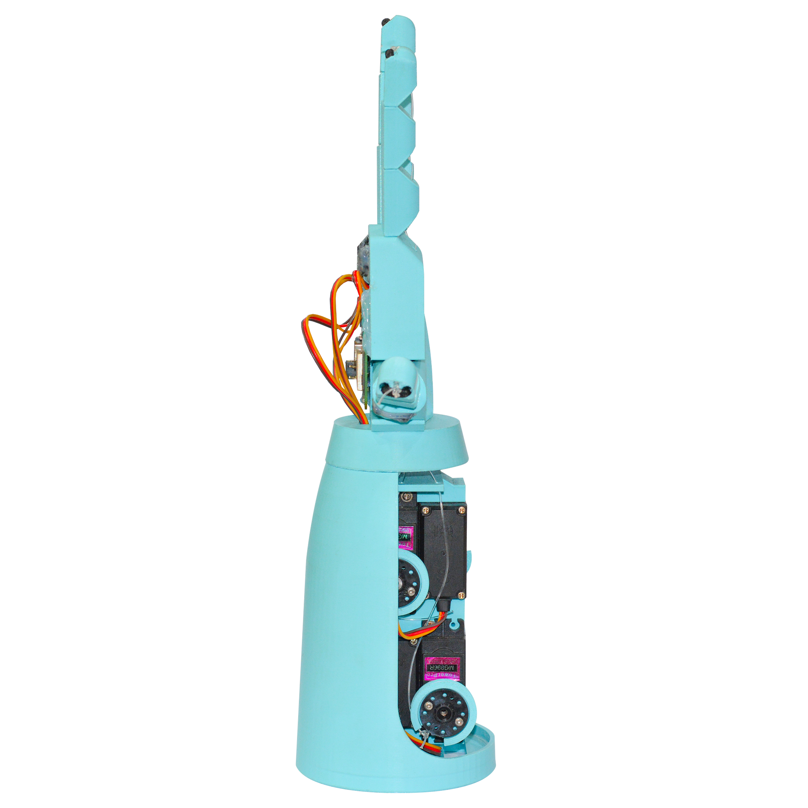 <small>🖼️ Side profile</small> | 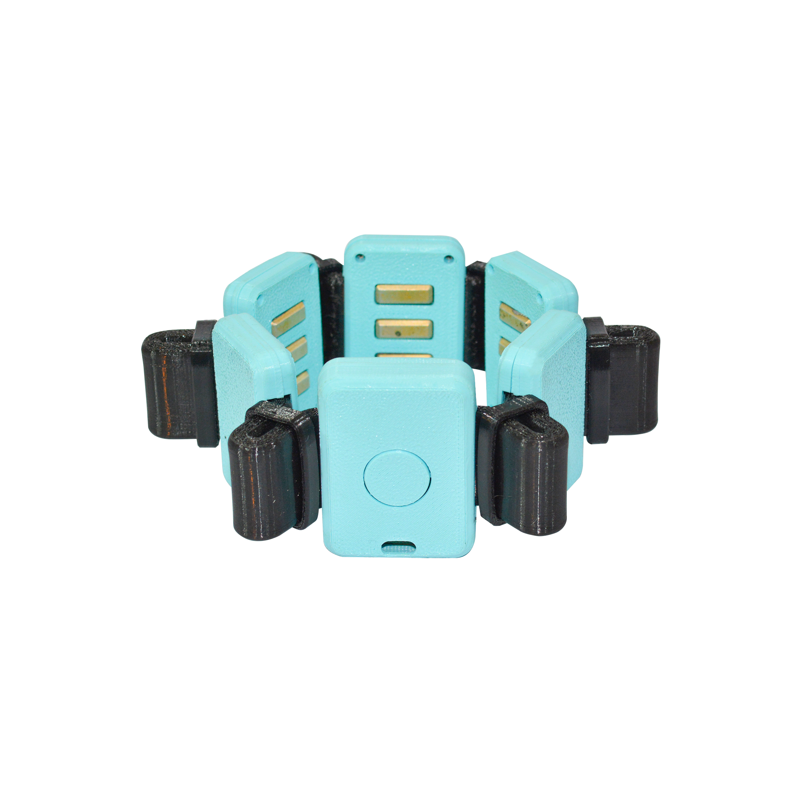 <small>🔬 Sensor block close-up</small> | 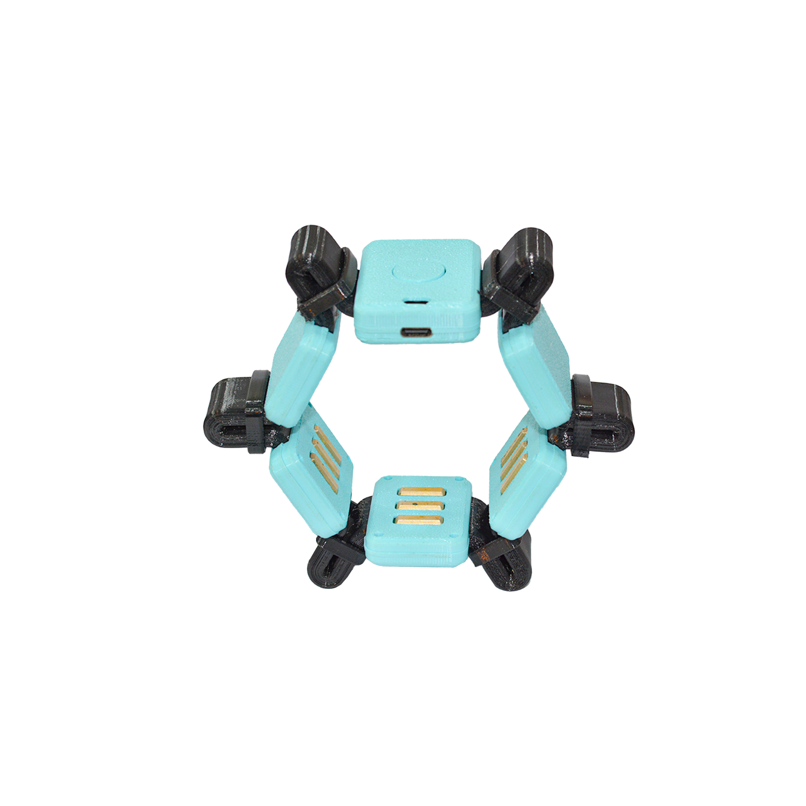 <small>🔗 Strap view</small> |

<strong>Live demo videos</strong>

	<video src="resources/video/Demo1.mp4" width="360" controls muted></video>
	<video src="resources/video/Demo2.mp4" width="360" controls muted></video>

<small>If embeds do not autoplay in your viewer, use the direct links: <a href="resources/video/Demo1.mp4">Demo1.mp4</a> · <a href="resources/video/Demo2.mp4">Demo2.mp4</a>.</small>

## Platform at a glance

| Layer | Highlights |
| --- | --- |
| 🛠️ **Hardware** | Low-noise EMG front-end, modular controller blocks, ready-to-manufacture assets, BOMs aligned to the photos you see. |
| 🧠 **Firmware** | ESP32 (ring + hand), FreeRTOS, NimBLE, OTA-ready, Line/Radar classifiers, servo current and motion guards to avoid stalls. |
| 📱 **App** | Flutter UX for BLE JSON control, half-float EMG streaming, auto pair/connect, per-user calibration, and live plots. |

## Architecture snapshot

Signal path in two stages: capture and clean EMG on the ring, classify intent and drive actuators on the hand controller. Calibration data lives in the app and syncs over BLE when you change modes.

<table>
	<tr>
		<td align="center">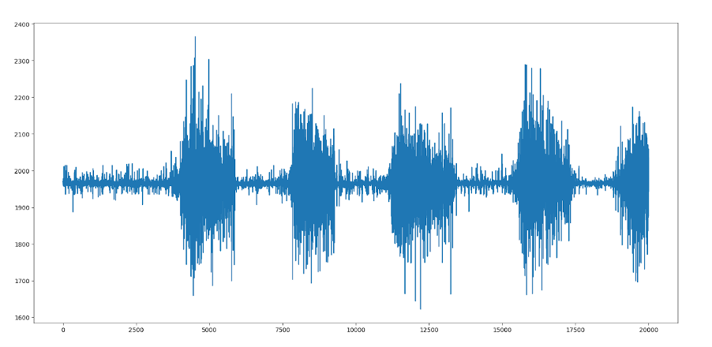 <small>⚡ Raw EMG capture</small></td>
			<td align="center">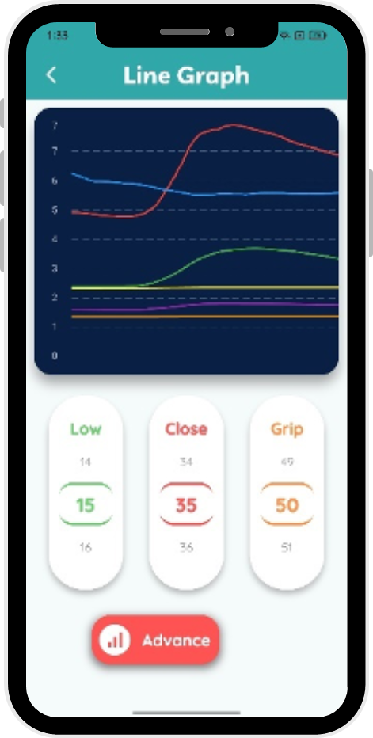 <small>🔎 Line thresholds</small></td>
			<td align="center">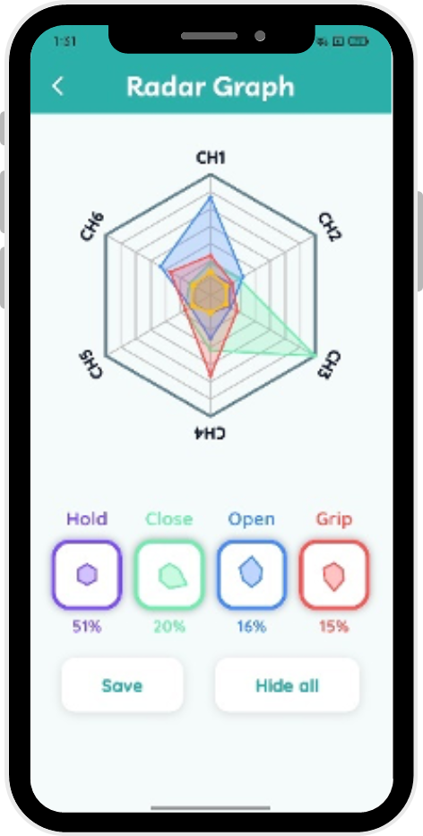 <small>🔁 Radar/Spider matching</small></td>
	</tr>
	<tr>
		<td align="center">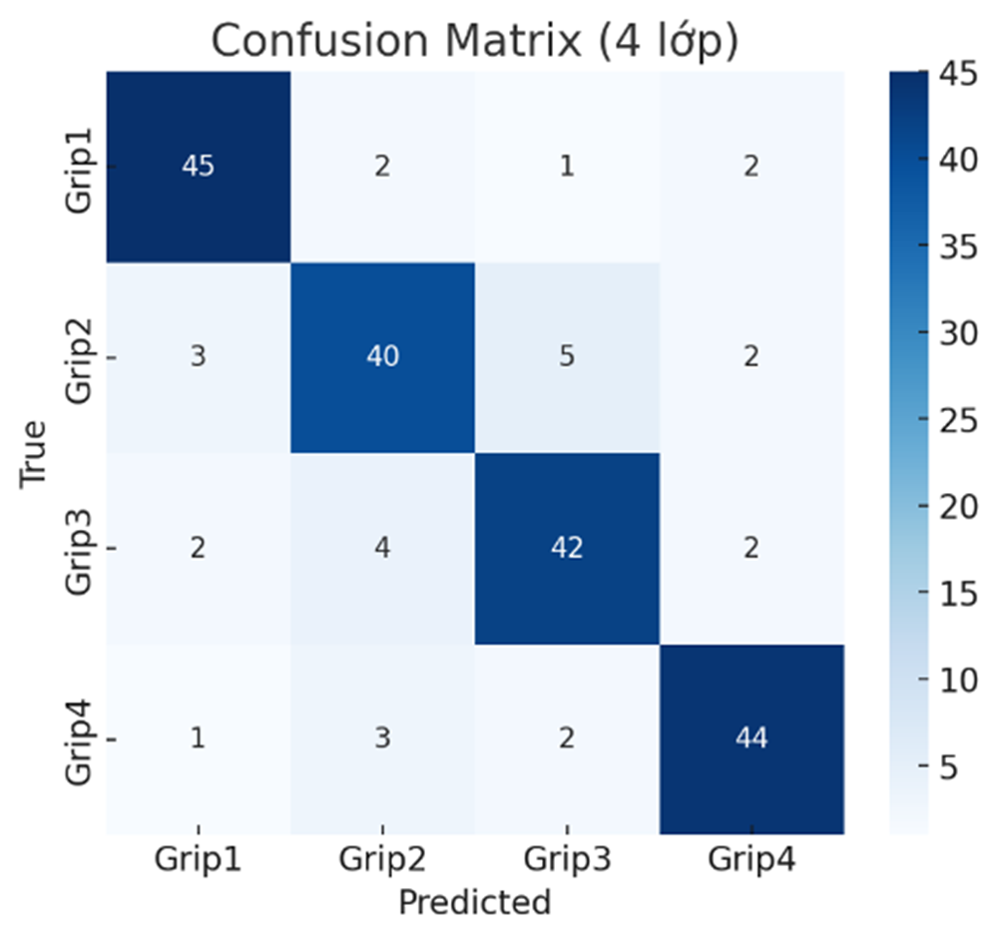 <small>✅ Match confidence</small></td>
		<td align="center">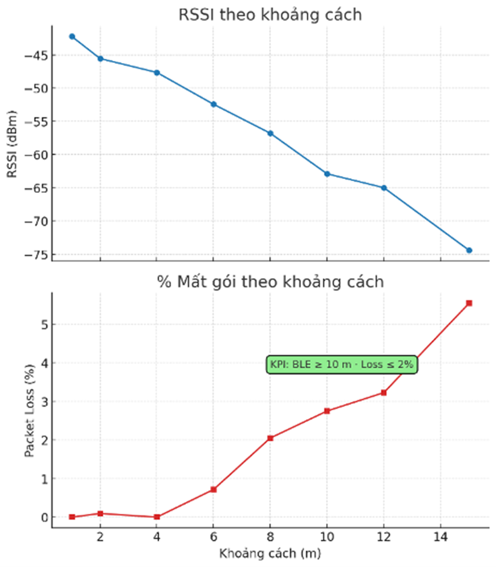 <small>➖ Similarity metric</small></td>
		<td align="center">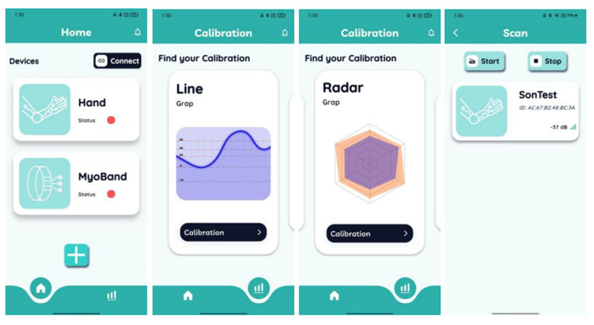 <small>📱 Flutter app in action</small></td>
	</tr>
</table>

## Deep dives
- Hardware overview, IC map, and board variants: [hardware/README.md](hardware/README.md)
- Firmware flow, EMG filters/classifiers, BLE/OTA services: [firmware/README.md](firmware/README.md)
- App BLE flows, JSON protocol, half-float decode, and UI cues: [app/README.md](app/README.md)

## Fast start
1) **Fabricate / assemble**: pick your board set from [hardware](hardware/README.md); use the included Gerbers and assembly files to keep builds consistent with the photos.
2) **Flash firmware**: open `firmware/Embedded` in VS Code + PlatformIO, select the target (ring/hand), and run `pio run -t upload`.
3) **Pair with the app**: run the Flutter app (see [app/README.md](app/README.md)), scan and save Hand + MyoBand, then start EMG streaming.
4) **Calibrate deliberately**: choose Line or Radar, adjust thresholds/templates, push to devices, and watch the live plots to confirm stability.
5) **Demo safely**: use the stall/over-activity protections while you tune grip strength or motion ranges.

## Tech highlights
- Half-precision EMG streaming keeps BLE lean; float32 reconstruction happens in the app for analysis.
- Dual control modes: Line (summed thresholds for fast response) and Radar/Spider (template similarity, ≥70% match) for finer intent mapping.
- Safety nets: relax-before-use gating, over-activity clamps, current-based stall detection on servos, watchdog-backed tasks, and OTA hooks for quick fixes.
- UX polish: LED/buzzer cues, auto reconnect, smoothed charts, per-grip calibration profiles, and JSON-based control that is easy to script.

## Licence

This project is licensed under the GNU GPLv3.  
Compared to permissive licences like MIT, GPLv3 requires that if you modify this code and distribute your version (including in commercial products), you must also release your changes under the same GPLv3 licence and provide the corresponding source code.  

This way, everyone can benefit from improvements built on top of this project.  
If this licence causes issues for your intended use, feel free to contact me – I’m open to discussing alternatives.

## Thanks

Huge thanks to contributors, early testers, and the open-source toolchains that made this build possible. Enjoy hacking, and share what you build.