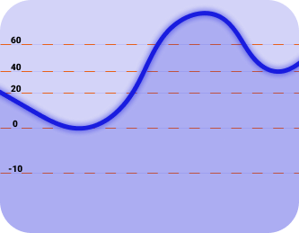
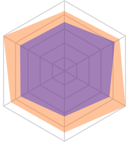
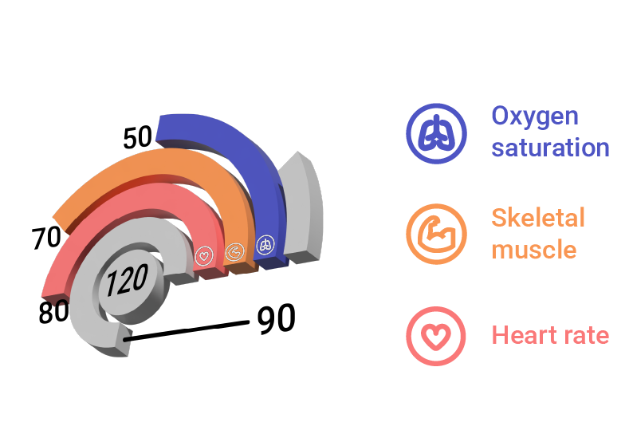

# 📱 EMGBand App

Your cockpit for the EMGBand/Hand Bionic stack. It pairs the Hand controller and the MyoBand EMG ring, streams six channels of muscle data in real time, lets you shape thresholds (Line or Radar), and flips control modes on the fly—using lean BLE with JSON commands and half-float payloads.

## What you can do
- One-tap scan, remember, and auto-connect to Hand + MyoBand.
- Stream six-channel EMG with smoothed, throttled charts that stay responsive.
- Calibrate two paradigms: Line (sum thresholds) and Radar/“Spider” (per-grip templates).
- Flip EMG control mode (Line ↔ Radar) and push thresholds instantly.
- Check battery/state; OTA UUIDs are already wired for upcoming updates.

## BLE architecture
- UUID catalog: [app/app_emg/lib/BLE/Service/bleService.dart](app/app_emg/lib/BLE/Service/bleService.dart) holds all Hand/MyoBand services and characteristics (setting, state, battery, OTA...).
- Scan UI: [app/app_emg/lib/BLE/UI/scanDevice.dart](app/app_emg/lib/BLE/UI/scanDevice.dart) filters by UUID, saves picks via SharedPreferences, and lists candidates.
- Connection orchestrator: [app/app_emg/lib/BLE/UI/deviceUser.dart](app/app_emg/lib/BLE/UI/deviceUser.dart) auto-connects saved devices, stops scanning when both are up, and kicks off discovery.
- Discovery & handles: [app/app_emg/lib/BLE/Service/myobandProcess.dart](app/app_emg/lib/BLE/Service/myobandProcess.dart) captures setting/battery/control characteristics and subscribes for EMG + telemetry.
- JSON link layer: [app/app_emg/lib/BLE/Helper/ManageJson.dart](app/app_emg/lib/BLE/Helper/ManageJson.dart) wraps UTF-8 encode/decode with retry/backoff; every command carries mode/type/val to mirror firmware parsing.

## EMG data path
1) Firmware packs EMG frames as float16 to shrink BLE payloads.
2) App receives little-endian uint16 words and expands with `halfToFloat` in [app/app_emg/lib/BLE/Helper/ConvertNum.dart](app/app_emg/lib/BLE/Helper/ConvertNum.dart): split sign/exp/mantissa, handle zero/subnormal/Inf/NaN, rebuild float32 bits, then read via ByteData.
3) Values are lightly low-pass smoothed and plotted live (fl_chart) in the calibration views.

## Calibration workflows
- **Line Threshold** ([app/app_emg/lib/BLE/UI/Features/MyoBandFealture/Calib/LineThreshold/lineThreshold.dart](app/app_emg/lib/BLE/UI/Features/MyoBandFealture/Calib/LineThreshold/lineThreshold.dart))
  - Start EMG RMS stream: `{mode:"set", type:"cmd", val:{type:"RMS", state:1}}` to the setting characteristic.
  - Decode EMG, show six channels plus the sum with gentle smoothing.
  - Read thresholds: `{mode:"set", type:"upd", val:"THL"}` → four ints (setup/low/high/grip).
  - Write thresholds: `{mode:"set", type:"cmd", val:{type:"THL", TH:"80:low:high:grip"}}`; UI enforces `low < high < grip`.

- **Radar / Spider** ([app/app_emg/lib/BLE/UI/Features/MyoBandFealture/Calib/RadarThreshold/radarThreshold.dart](app/app_emg/lib/BLE/UI/Features/MyoBandFealture/Calib/RadarThreshold/radarThreshold.dart))
  - Stream EMG RMS, normalize each channel (0..40) to 0..1.
  - Score each of four grip templates: per channel `1 - |c - t| / |t|` clipped to [0,1]; average six channels, accept if ≥70%.
  - Read templates: `{mode:"set", type:"upd", val:"THS"}` → firmware returns 4×6 floats.
  - Write a template: `{mode:"set", type:"cmd", val:{type:"THS", TH:"id@v1:v2:v3:v4:v5:v6"}}`.

- **Switch EMG mode** ([app/app_emg/lib/BLE/UI/DeviceDetail/myobandDetail.dart](app/app_emg/lib/BLE/UI/DeviceDetail/myobandDetail.dart))
  - Send `{mode:"set", type:"cmd", val:{type:"EMGCtrl", state:1|2}}` to pick Line or Radar; read current with `{mode:"set", type:"upd", val:{type:"EMGCtrl"}}`.

## App flow in practice
1) First run: open Scan, find Hand + MyoBand (UUID-filtered), save them for auto-connect.
2) Device screen: tap “Scan/Connect” → the app pairs both, discovers characteristics, and shows live status.
3) Calibrate:
   - Line tab: start stream, watch six channels plus sum, adjust low/high/grip, write back.
   - Radar tab: watch match %, tweak four grip vectors, write back.
4) Switch control mode (Line ↔ Radar) in MyoBand detail when you change paradigms.

## OTA hook
- OTA UUIDs are defined; UI flow is pending. Assets include `update.gif` as a placeholder. Future flow: enter OTA mode, upload image over the OTA characteristic, verify, reboot.

## Assets (for docs/demos)
- Layouts: hand + myoband SVGs [app/app_emg/assets/images/layouts](app/app_emg/assets/images/layouts)
- Calibration illustrations: line/radar/healthy PNGs [app/app_emg/assets/images/calibrate](app/app_emg/assets/images/calibrate)
- GIFs: update/oops [app/app_emg/assets/images/gif](app/app_emg/assets/images/gif)

Example embeds (centered for readability):

<table>
	<tr>
		<td align="center"> <small>Line calibration</small></td>
		<td align="center"> <small>Radar (spider) calibration</small></td>
		<td align="center"> <small>Healthy posture hint</small></td>
	</tr>
</table>

## Source map
- BLE UUIDs/constants: [app/app_emg/lib/BLE/Service/bleService.dart](app/app_emg/lib/BLE/Service/bleService.dart)
- BLE controller/state: [app/app_emg/lib/BLE/Service/bleController.dart](app/app_emg/lib/BLE/Service/bleController.dart)
- MyoBand discovery & handles: [app/app_emg/lib/BLE/Service/myobandProcess.dart](app/app_emg/lib/BLE/Service/myobandProcess.dart)
- Scan UI: [app/app_emg/lib/BLE/UI/scanDevice.dart](app/app_emg/lib/BLE/UI/scanDevice.dart)
- Device connect UI: [app/app_emg/lib/BLE/UI/deviceUser.dart](app/app_emg/lib/BLE/UI/deviceUser.dart)
- EMG Line calibration: [app/app_emg/lib/BLE/UI/Features/MyoBandFealture/Calib/LineThreshold/lineThreshold.dart](app/app_emg/lib/BLE/UI/Features/MyoBandFealture/Calib/LineThreshold/lineThreshold.dart)
- EMG Radar calibration: [app/app_emg/lib/BLE/UI/Features/MyoBandFealture/Calib/RadarThreshold/radarThreshold.dart](app/app_emg/lib/BLE/UI/Features/MyoBandFealture/Calib/RadarThreshold/radarThreshold.dart)
- Half/float conversion: [app/app_emg/lib/BLE/Helper/ConvertNum.dart](app/app_emg/lib/BLE/Helper/ConvertNum.dart)