# 🔧 Hardware Reference

The definitive pit stop for every PCB in the EMGBand/Hand Bionic stack. Each section tells you what the board does, how it talks to the rest, where to grab build assets, and what to check before you power it up—plus a gallery pulled straight from the committed files.

## 📌 At-a-glance

| Board | Role | Primary interfaces | Manufacturing kit |
| --- | --- | --- | --- |
| [Hand_main](#hand_main) | Bionic hand controller, Wi-Fi/BLE, power/rail monitor | USB-C, UART, GPIO, RGB LED | `Hand_main/*.kicad_*`, top/bottom photos |
| [myoband_main](#myoband_main) | Wearable hub for EMG/IMU/mic, power + comms | USB-UART, Wi-Fi/BLE, SPI/I2C/I2S, ADC | `myoband_main/*.kicad_*`, top/bottom photos |
| [myoBand_emg](#myoBand_emg) | EMG front-end with INA333 multi-stage filtering | Differential electrodes → analog out | `myoBand_emg/*.kicad_*`, top/bottom photos |
| [myoBand_emg_Renesas v0.2](#myoBand_emg_renesas-v02) | EMG front-end using ISL28533 | Differential electrodes → analog out | `myoBand_emg_Renesas/myoBand_emg_v0_2/*.kicad_*` |
| [myoBand_emg_Simulation](#myoBand_emg_simulation) | EMG filter/response simulation | N/A (SPICE) | `myoBand_emg_Simulation/*.kicad_*` |

---

## 🧠 Hand_main

### Highlights
- ESP32-WROOM-32D brain with Wi-Fi/BLE and a status RGB LED to keep you informed at a glance.
- INA3221 keeps eyes on three rails, so servos and external loads stay within safe current/voltage envelopes.
- TPS54620 buck + XC6220 LDO make clean rails; CP2102N USB–UART streamlines flashing and debug.

### Quick specs

| Parameter | Detail |
| --- | --- |
| MCU | ESP32-WROOM-32D |
| Power | Buck 5V→system, 3V3 LDO |
| Power monitor | INA3221 (3 channels) |
| Interfaces | USB-C/CP2102N, GPIO headers, WS2812 data |

### Manufacturing files
- [Hand_main/Hand_main.kicad_sch](Hand_main/Hand_main.kicad_sch)
- [Hand_main/Hand_main.kicad_pcb](Hand_main/Hand_main.kicad_pcb)
- [Hand_main/Hand_main.pdf](Hand_main/Hand_main.pdf)

### Build & test checklist
- Double-check buck polarity and place L/C exactly as laid out to keep EMI tame.
- Probe buck and 3V3 rails before seating the ESP32 or any sensitive loads.
- Confirm USB-C orientation/UART lines, then sanity-check INA3221 readings with a dummy load.

### Gallery

<table>
	<tr>
		<td align="center">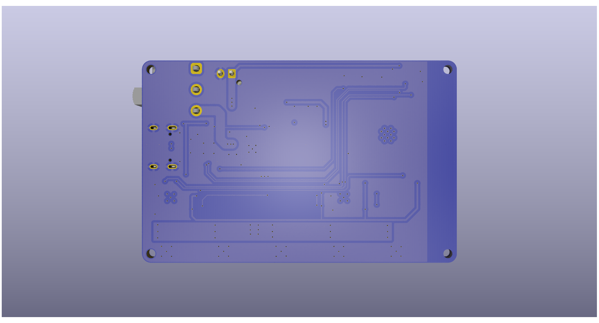 <small>Top — overview</small></td>
		<td align="center">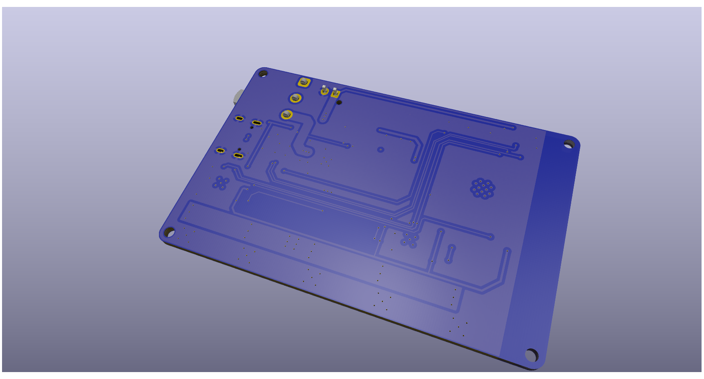 <small>Top — ESP32 & power</small></td>
	</tr>
	<tr>
		<td align="center">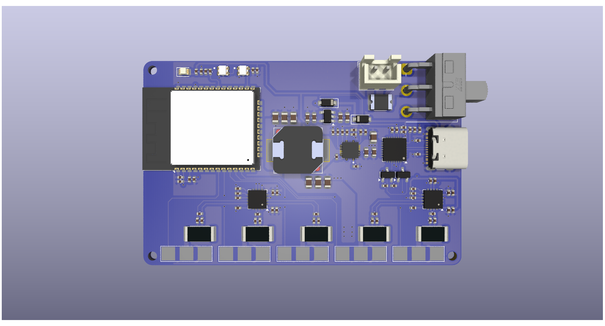 <small>Bottom — routing</small></td>
		<td align="center"> <small>Bottom — pours</small></td>
	</tr>
</table>

---

## 🧭 myoband_main

### Highlights
- ESP32-PICO-V3-02 wearable hub that ingests EMG (MCP3208), IMU data (LSM6DSL), and PDM audio (INMP441).
- Power spine: TP4056 Li-ion charger, 3V3 LDO for logic, TPS60402 negative rail for the analog front-end.
- CP2102N handles flashing/debug; WS2812B-2020 signals state; headers expose SPI/I2C/I2S for expansions.

### Quick specs

| Parameter | Detail |
| --- | --- |
| MCU | ESP32-PICO-V3-02 |
| EMG conversion | MCP3208 (12-bit SPI) |
| Sensors | IMU LSM6DSL, mic INMP441 |
| Power | TP4056 charger, 3V3 LDO, TPS60402 negative rail |
| Interfaces | Wi-Fi/BLE, USB-UART, SPI/I2C/I2S, GPIO |

### Manufacturing files
- [myoband_main/myoband_main.kicad_sch](myoband_main/myoband_main.kicad_sch)
- [myoband_main/myoband_main.kicad_pcb](myoband_main/myoband_main.kicad_pcb)
- [myoband_main/myoband_main.pdf](myoband_main/myoband_main.pdf)

### Build & test checklist
- Inspect TP4056 charge path and battery polarity; watch thermals at higher charge currents.
- Verify the TPS60402 negative rail before biasing the EMG analog stage.
- Smoke-test everything together: Wi-Fi/BLE, SPI EMG ADC, I2C IMU, PDM mic—and listen for noise coupling.

### Gallery

<table>
	<tr>
		<td align="center">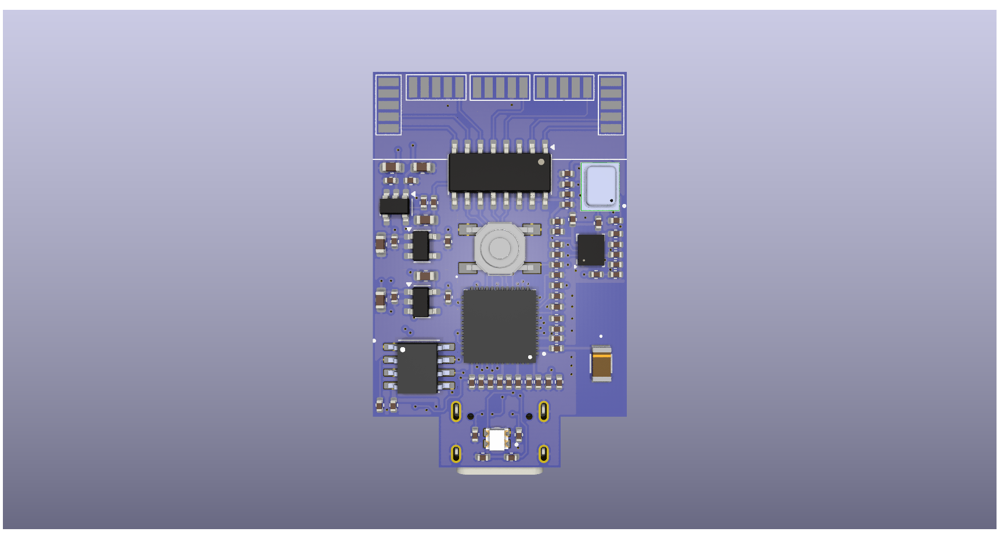 <small>Top — overview</small></td>
		<td align="center">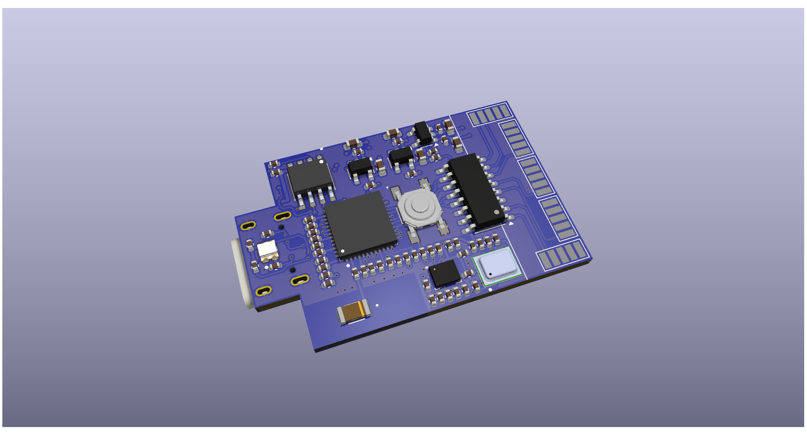 <small>Top — MCU & IO</small></td>
		<td align="center"> <small>Top — power/charger</small></td>
	</tr>
	<tr>
		<td align="center">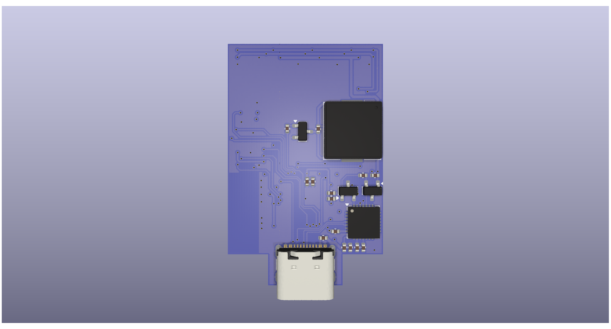 <small>Bottom — routing</small></td>
		<td align="center">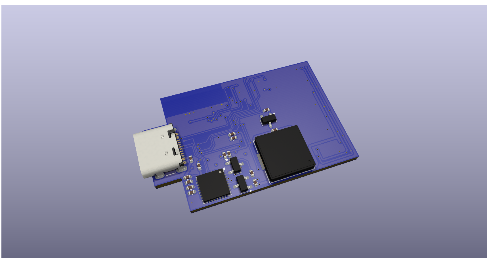 <small>Bottom — pours</small></td>
		<td align="center">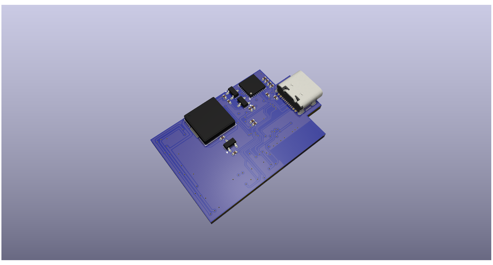 <small>Bottom — placement</small></td>
	</tr>
</table>

---

## 🩺 myoBand_emg (INA333)

### Highlights
- INA333-based EMG front-end for low-noise differential gain, feeding MCP601 stages for band-pass/notch shaping.
- TPS60402 negative rail preserves headroom and keeps distortion low at higher amplitudes.
- Layout favors short electrode runs and clean analog planes away from digital chatter.

### Quick specs

| Parameter | Detail |
| --- | --- |
| Instrumentation amp | INA333 |
| Filter op-amp | MCP601 (multi-stage) |
| Power | Negative rail via TPS60402, bias/offset via R/C network |
| Output | Analog to ADC (e.g., MCP3208 on myoband_main) |

### Manufacturing files
- [myoBand_emg/EMG_SENSOR.kicad_sch](myoBand_emg/EMG_SENSOR.kicad_sch)
- [myoBand_emg/EMG_SENSOR.kicad_pcb](myoBand_emg/EMG_SENSOR.kicad_pcb)
- [myoBand_emg/EMG_SENSOR.pdf](myoBand_emg/EMG_SENSOR.pdf)

### Build & test checklist
- Match R/C values to your target corners; confirm INA333 orientation and gain resistors.
- Measure the negative rail before attaching electrodes; verify mid-bias to avoid clipping.
- Characterize baseline noise; notch the mains band or add ferrites if hum shows up.

### Gallery

<table>
	<tr>
		<td align="center">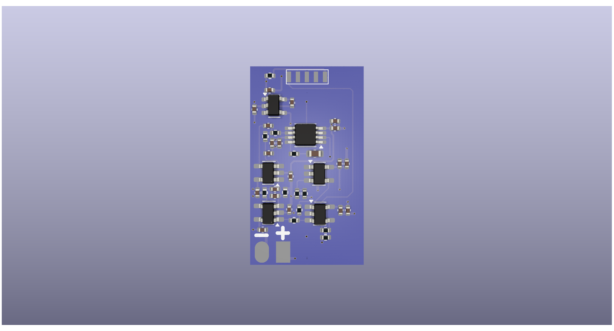 <small>Top — overview</small></td>
		<td align="center">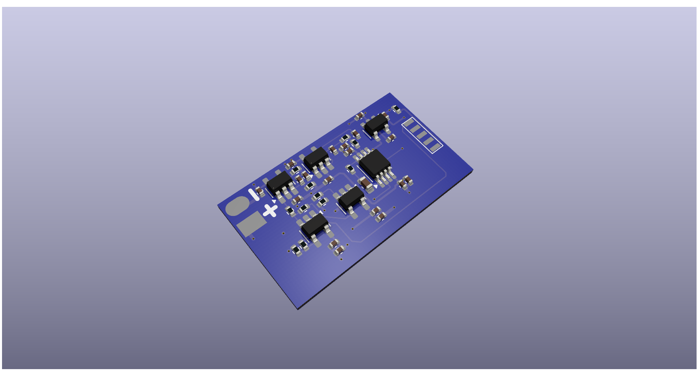 <small>Top — amp/filter</small></td>
	</tr>
	<tr>
		<td align="center">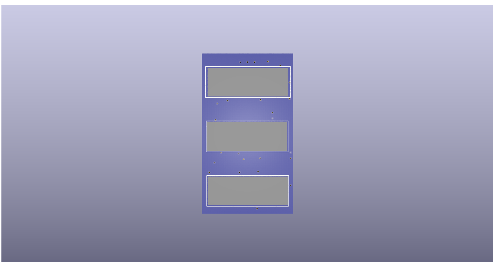 <small>Bottom — routing</small></td>
		<td align="center">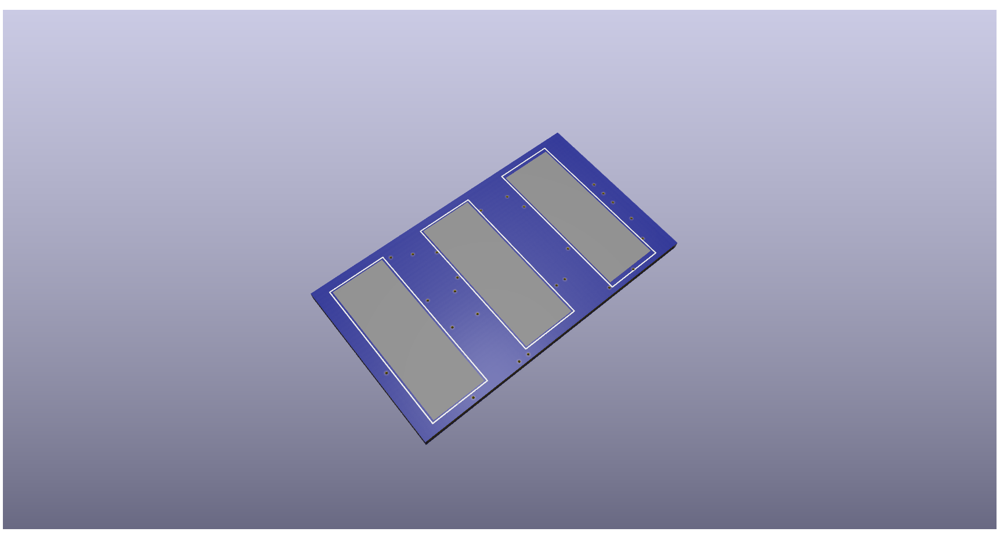 <small>Bottom — pours</small></td>
	</tr>
</table>

---

## 🩺 myoBand_emg_Renesas v0.2 (ISL28533)

### Highlights
- Renesas ISL28533 variant for a broader dynamic range and lower noise floor.
- MCP601 stack still handles staged gain and filtering; rails/bias come from the hub via R/C network.
- Same disciplined layout: short electrode routes, isolated analog plane, test-points where you need them.

### Quick specs

| Parameter | Detail |
| --- | --- |
| Instrumentation amp | ISL28533 |
| Filter op-amp | MCP601 |
| Power | Rails/bias from hub or external (no onboard charge pump) |
| Output | Analog to hub ADC |

### Manufacturing files
- [myoBand_emg_Renesas/myoBand_emg_v0_2/myoBand_emg_v0_2.kicad_sch](myoBand_emg_Renesas/myoBand_emg_v0_2/myoBand_emg_v0_2.kicad_sch)
- [myoBand_emg_Renesas/myoBand_emg_v0_2/myoBand_emg_v0_2.kicad_pcb](myoBand_emg_Renesas/myoBand_emg_v0_2/myoBand_emg_v0_2.kicad_pcb)
- [myoBand_emg_Renesas/myoBand_emg_v0_2/myoBand_emg_v0_2.pdf](myoBand_emg_Renesas/myoBand_emg_v0_2/myoBand_emg_v0_2.pdf)

### Build & test checklist
- Validate mid-rail bias when powered from the hub; confirm ISL28533 headroom at your chosen gain.
- A/B noise against the INA333 build to choose the production winner.
- Drop in renders/photos once assembled to lock placement confidence.

### Gallery
- No images in this folder yet; drop in PNG/JPG renders or photos when ready.

---

## 🧪 myoBand_emg_Simulation

### Highlights
- SPICE sandbox to shape EMG gain and filter response before you spend copper.
- Ideal sources and R/C only—no production silicon here.

### Quick specs

| Parameter | Detail |
| --- | --- |
| Purpose | Frequency/gain/notch simulation |
| Components | Ideal sources, R/C |
| Output | Simulated waveforms |

### Files
- [myoBand_emg_Simulation/myoBand_emg_Simulation.kicad_sch](myoBand_emg_Simulation/myoBand_emg_Simulation.kicad_sch)
- [myoBand_emg_Simulation/myoBand_emg_Simulation.kicad_pcb](myoBand_emg_Simulation/myoBand_emg_Simulation.kicad_pcb)

---

## 🖼️ Image & path guidance

- Use forward slashes `/` in image paths; links are relative to this README.
- Example: ``.
- GitHub renders images once the PNG files are present; add new renders/photos in the matching board folder.
- Prefer per-board READMEs or a PDF gallery? Say the word and we will scaffold it.

---

_Last refreshed: check git history for the latest author/date._